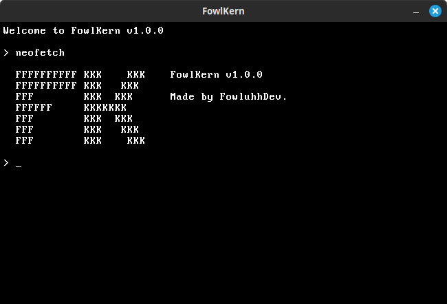

# FowlKern

A joke operating system kernel made with Python and PyGame.

## How to build

To build, you will need to install PyGame, assuming you already have Python 3.9+. Once you have PyGame, run in the project folder "python main.py" for Windows, or "python3 main.py" for MacOS and Linux.